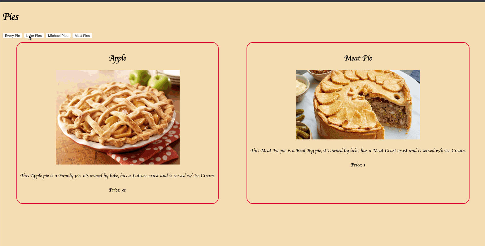

# Event Listeners

For this project, I experimented with Event Listeners to see how they worked. As you can see in the preview, depending on the button you click, it runs a function that looks at the content of each card, resulting in a filter of a User's pies.

## Preview

## View Project
- Clone the repository 👉🏼`$ git clone https://github.com/RyanBeiden/event-listeners.git`

- Run any http server `$ hs` or code editor to view project 👀

## Technologies Used

